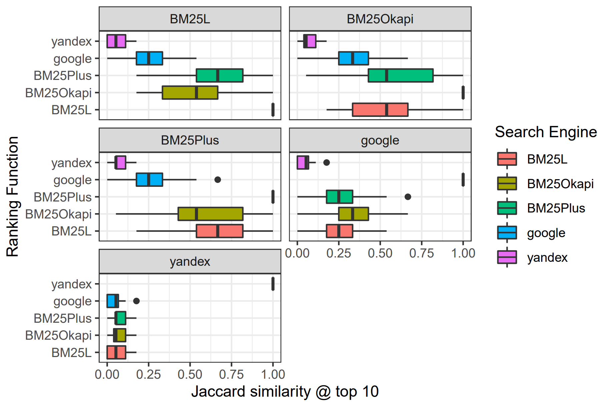

# Algorithmic Transparency on Search Engines Research

## Disclaimer
This research is a Bachelor's Graduation Thesis for [ITMO University](https://www.usnews.com/education/best-global-universities/itmo-university-529154)

❗ It is important to note that this study is experimental and introductory, and it does not pretend to disclose engines' algorithms completely. However, the approach used may lead to further investigations in this area.

This README offers a brief overview, the complete report is available in the [PDF document](./thesis-algorithmic-transparency-of-se.pdf).

## Overview
This research aims to reveal the internal mechanisms of search engines through an adversarial transparency approach. Given that crawling and ranking algorithms are often opaque, we audit search engines as online black boxes to analyze their operations.

Our primary objectives include _setting up a monitoring system_ to interface with a specific search engine and demonstrating its application through two use cases: _analyzing collected data_ and robots' records, and _analyzing query rankings._

The monitoring system is conceived as a [Petri dish](https://en.wikipedia.org/wiki/Petri_dish), where an “ecosystem” matches the search engine with its search robots, web pages, and algorithms, while a honeypot website acts as an "outer organism." The process involves crawlers visiting the honeypot, gathering information, and processing data to identify engine behavior patterns.

Another application is query ranking analysis, which uses a honeypot to post documents. Known ranking functions are tested locally, and search engines are queried to compare local and remote orderings, measuring the similarity of ranking functions.

The novelty here is studying search engines from the adversarial
perception, assuming no collaboration with them. By not relying on public knowledge (e.g. some engines share information among themselves), the research confirms data veracity and demonstrates the ability to reveal undisclosed information without search engine consent.

## Results
### Monitoring System

#### Engines Similarity Rate

We employed the [Jaccard index](https://en.wikipedia.org/wiki/Jaccard_index) to calculate the similarity rate, utilizing the site versions discovered by search robots as set, so here is a colour matrix.

#### Re-index Time

Shortly, this type of plot is a five-number summary of our honeypot web page re-indexing time distribution.

❕ For more details on monitoring system implementation, and even more obtained results, please refer to [Chapter 2](./thesis-algorithmic-transparency-of-se.pdf).

### Ranking

#### Ranking Similarity Rates
In comparing ranking functions, we employed both the Jaccard index and [Spearman’s coefficient](https://en.wikipedia.org/wiki/Spearman%27s_rank_correlation_coefficient).
However, the obtained disagreements in results prevented us from determining that the examined search engines solely rely on one of the BM25 functions. Nevertheless, you can explore the Box and Whiskers plot for the Jaccard index and the color matrix for Spearman’s coefficient below.

❕ For a more in-depth analysis, refer to [Chapter 3](./thesis-algorithmic-transparency-of-se.pdf).

